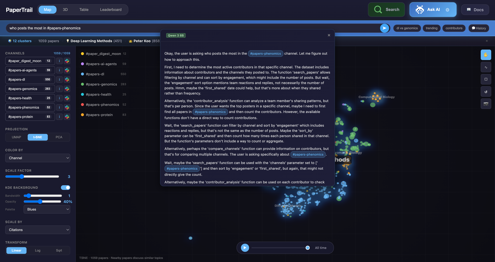
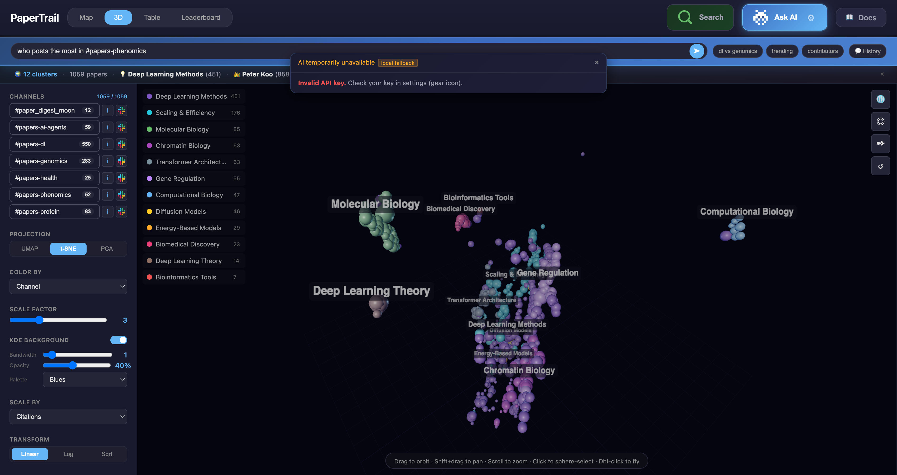
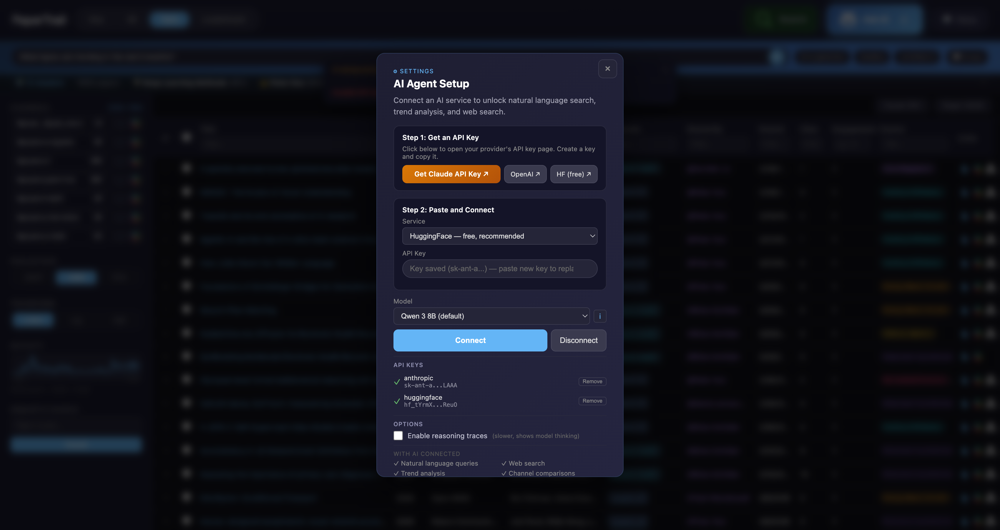
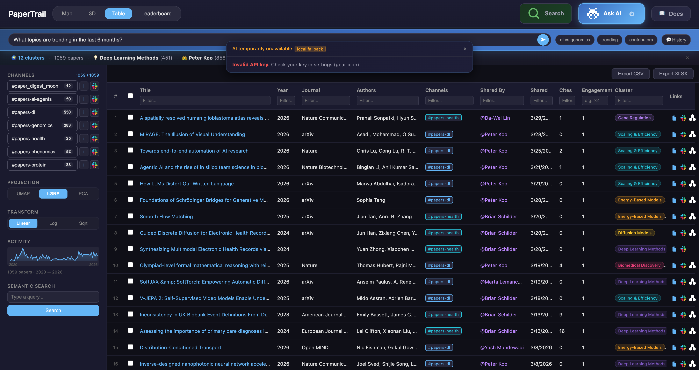

# Dashboard Guide

The PaperTrail dashboard is a self-contained interactive HTML file for exploring your team's paper landscape. No server required — just open in any browser.

**[Live Demo: Koo Lab Dashboard](https://bschilder.github.io/PaperTrail/koolab/)**

## Views

The dashboard has four main views, accessible from the top navigation bar.

### Map View

The default view — a canvas-based 2D scatter plot where each dot is a paper.



**Key features:**

| Region | What it does |
|--------|-------------|
| **Scatter plot** (center) | Papers plotted by semantic similarity. Nearby papers discuss similar topics. |
| **Topic labels** | Hierarchical cluster labels with colored pill outlines. Zoom in to see subtopics. |
| **Topic lines** | Lines connecting related topics (configurable thickness, opacity, curve, color). |
| **Channel filter** (left sidebar) | Toggle channels on/off. Deselected papers fade to ghost dots. |
| **Projection buttons** | Switch between UMAP (default), t-SNE, and PCA projections. |
| **Color By** | Cluster (default), Channel, Year, Citations, Engagement, Density, Contributor, Journal. |
| **Scale By** | Engagement (default), Citations, Year, Uniform. Controls dot size. |
| **KDE Background** | Density heatmap with configurable bandwidth, opacity, and palette. |
| **Topic Lines** | Toggle and configure connection lines between topic clusters. |
| **Time slider** (bottom) | Scrub through time or press play for chronological animation. Papers fade in smoothly. |
| **Tool buttons** (right) | Pan, lasso select, rectangle select, reset zoom, save as PNG. |

**Interactions:**

- **Scroll** to zoom in/out
- **Click + drag** to pan
- **Click a dot** to see paper details
- **Click a topic label** for topic info popup (paper count, top contributors, top papers)
- **Lasso/rectangle** to select multiple papers
- **Hover** over topics for paper count tooltip

### 3D View

WebGL-powered 3D scatter plot using Three.js.



- **Rotate**: Click + drag
- **Zoom**: Scroll
- **Click**: Select paper
- Same color modes as Map view

### Table View

Sortable, filterable spreadsheet of all papers.



**Columns:** Title, Year, Journal, Authors, Channels, Shared By, Date Shared, Citations, Engagement, Cluster.

- **Click column header** to sort ascending/descending
- **Filter row** below headers — type to filter (supports `>5`, `>=10` for numeric columns)
- **Click row** to see paper detail panel
- **Export CSV / Export XLSX** buttons in top-right
- **Slack icon** links directly to the original Slack message
- **Paper icon** links to the paper URL

### Leaderboard View

Rankings and statistics about your paper collection.



- **Top Contributors** — Who shares the most papers, with contribution heatmap
- **Most Engaged** — Papers with the most reactions + replies
- **Most Cited** — Highest citation count papers
- **Topic Breakdown** — Cluster sizes and proportions
- **Channel Stats** — Papers per channel with bar charts

## AI Agent

Click **Ask AI** in the top-right to open the AI-powered search bar.

**What you can ask:**

- `"What are the most cited papers about protein design?"` — searches papers with tool use
- `"Who contributes the most to genomics?"` — contributor analysis
- `"Compare #papers-dl and #papers-genomics"` — channel comparison
- `"What's trending in the last 6 months?"` — trend analysis
- `@Peter Koo` or `#papers-dl` — autocomplete for people and channels

**Configuration** (click the gear icon inside Ask AI):

- **Service**: HuggingFace (free, default), Anthropic (Claude), OpenAI
- **Model**: Qwen 3 8B (default), plus 8 other models
- **Reasoning traces**: Optional toggle to show model thinking
- **Chat history**: Downloadable in JSON or CSV format

## Semantic Search

Click **Search** to open the semantic search bar. Type a query and papers are ranked by content similarity — not keyword matching. Results are highlighted and sized by relevance.

**Example queries:**

- `single cell RNA sequencing`
- `attention mechanism transformer`
- `protein folding prediction`

## Keyboard Shortcuts

| Key | Action |
|-----|--------|
| `1` / `2` / `3` | Switch projection (UMAP/t-SNE/PCA) |
| `V` | Pan mode |
| `L` | Lasso select mode |
| `R` | Rectangle select mode |
| `/` | Open AI agent |
| `?` | Show all shortcuts |
| `Esc` | Close panels |
| Arrow keys | Switch views |

## URL Hash State

The dashboard saves your current view state in the URL hash. Share URLs like:

```
dashboard.html#p=umap&c=cluster&s=engagement&z=1.5
```

Parameters: `p` (projection), `c` (color mode), `s` (scale mode), `z` (zoom level).

## Building the Dashboard

### From CLI

```bash
papertrail build papers_final.json -o dashboard.html --title "My Lab"
```

### From Python

```python
from papertrail.preview import build_preview

build_preview(papers, output_path="dashboard.html", title="My Lab")
```

### Automated Pipeline

The GitHub Actions pipeline automatically builds and deploys the dashboard weekly:

1. Scrapes all configured Slack channels
2. Enriches metadata via OpenAlex/Crossref/bioRxiv APIs
3. Computes embeddings and hierarchical clusters
4. Builds dashboard and deploys to GitHub Pages

See [Deployment Guide](../getting-started/quickstart.md) for setup instructions.

## Deployment

The dashboard is deployed to GitHub Pages at:

```
https://<username>.github.io/PaperTrail/<workspace>/
```

Where `<workspace>` is derived from your Slack workspace URL in `config.yml`. For example, `koolab.slack.com` deploys to `/koolab/`.

The old `/dashboard/` path redirects automatically.
